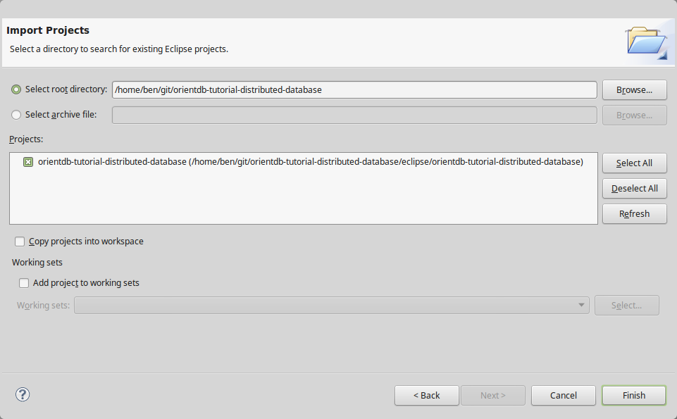
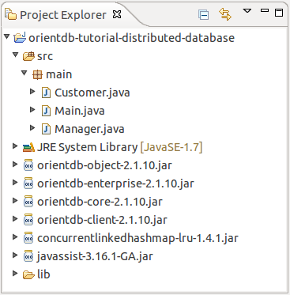

# Access DB with Java

In this chapter we will access the database from Eclipse via Java.
For a better start, the authors of the book have already created an example Java-Project.
Afterwards the methods of the example will be explained. If you understood this example, you can modify it and run your own tests.

# Import Project to Eclipse

First of all you have to import the example project in eclipse.

1. Start Eclipse
1. File -> Import -> General -> Existing Projects to Workspace

    Select the "orientdb-tutorial-distributed-database" folder from the downloaded repository.
    
    

After the import the project, your project explorer should be similar with this:



In the proje


# ...


The customer example is a Java-Object-Project, so we have to use the Object-API from OrientDB:

http://orientdb.com/docs/last/Object-Database.html


importierten
connect ... main s, was passiert dissconnect


For the customer example we will made a Java-Object-Project. There will be classes like Customer and methods to access, write and read the database. 
First of all we have to create a new Java project.  


1. Start Eclipse
1. File -> New -> Project -> Java Project

    Projectname: *orientdb-tutorial-distributed-database*
    
1. Add external JARs

    For the communication whith the database we need some external JARs from orientdb.
    This is also explained here:     http://orientdb.com/docs/2.0/orientdb.wiki/Object-Database.html
    
    For our example import those libraries from external orientdb folder:

    *./oriendb/lib/* :
    
    ```
    orientdb-core-*.jar
    orientdb-object-*.jar   
    orientdb-client-*.jar
    orientdb-enterprise-*.jar    
    concurrentlinkedhashmap-*.jar
    javassist*.jar
    ```

1. Add new classes *Main*, *Manager* and *Customer* to project

    scr -> new -> class 
    Name : *Main*
    Package : main
    
    scr -> new -> class 
    Name : *Manager* 
    Package : main
    
    scr -> new -> class 
    Name : *Customer* 
    Package : main
    
    private member ID and Name
    generate getter and setter
    @Override toString()
    @Override equals

get ips from docker "docker network inspect bridge"

1. 
1. 
1. 
1. 
1. 


screen-shots from project explorer